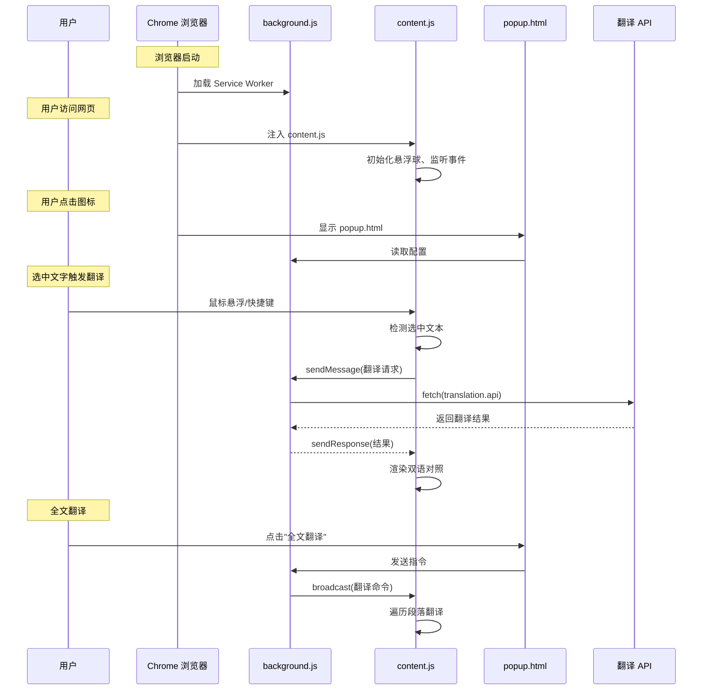

# FluentRead 打包原理与架构详解

本文档详细说明 FluentRead 项目的打包原理、Chrome 插件结构以及源代码与编译产物的对应关系。

---

## 📋 目录

- [项目结构总览](#项目结构总览)
- [源代码 vs 编译产物](#源代码-vs-编译产物)
- [WXT 框架打包流程](#wxt-框架打包流程)
- [核心文件映射表](#核心文件映射表)
- [运行时加载流程](#运行时加载流程)
- [代码分割策略](#代码分割策略)
- [调试技巧](#调试技巧)
- [常见问题](#常见问题)

---

## 🗂️ 项目结构总览

### 源代码结构

```
FluentRead/
├── entrypoints/                 # 入口文件（WXT 自动识别）
│   ├── background.ts          # 后台服务脚本
│   ├── content.ts             # 内容脚本（注入网页）
│   ├── popup/                  # 弹出配置界面
│   │   ├── App.vue
│   │   ├── main.ts
│   │   └── index.html
│   ├── offscreen/              # 离屏页面
│   │   ├── main.ts
│   │   └── index.html
│   ├── service/                # 翻译服务实现（24 种）
│   │   ├── custom.ts         # 自定义接口（如 Ollama）
│   │   ├── deepl.ts
│   │   ├── google.ts
│   │   └── ... (24 个文件)
│   └── utils/                  # 工具函数库
│       ├── config.ts         # 配置管理
│       ├── translateApi.ts   # 翻译 API
│       ├── cache.ts          # 缓存管理
│       └── ... (17 个文件)
├── components/                 # Vue 组件
│   ├── CustomHotkeyInput.vue
│   ├── FloatingBall.vue
│   ├── SelectionTranslator.vue
│   └── ...
├── public/                     # 静态资源（直接复制）
│   └── icon/                   # 扩展图标
├── styles/                     # 全局样式
│   └── theme.css
└── wxt.config.ts             # WXT 配置文件
```

### 编译后结构（.output/chrome-mv3/）

```
.output/chrome-mv3/
├── manifest.json              # 插件清单文件
├── background.js              # 后台服务工作进程
├── popup.html                  # 弹出页面
├── offscreen.html              # 离屏页面
├── content-scripts/
│   ├── content.js            # 内容脚本
│   └── content.css            # 内容样式
├── chunks/                    # 代码分割块
│   ├── popup-xxx.js
│   ├── offscreen-xxx.js
│   └── CustomHotkeyInput-xxx.js
├── assets/                    # 静态资源
│   ├── popup-xxx.css
│   ├── style.css
│   └── approve.jpg
└── icon/                      # 图标文件
    ├── 16.png
    ├── 48.png
    └── 128.png
```

---

## 🔄 源代码 vs 编译产物

### 完整映射关系图

```
源代码 (entrypoints/)                   编译产物 (.output/chrome-mv3/)
┌─────────────────────────┐             ┌─────────────────────────────┐
│ background.ts          │────────────►│ background.js              │
│ (后台脚本，7.6KB)        │  TypeScript  │ (Service Worker, 235KB)     │
└─────────────────────────┘  编译       └─────────────────────────────┘

┌─────────────────────────┐             ┌─────────────────────────────┐
│ content.ts             │────────────►│ content-scripts/content.js  │
│ (内容脚本，37KB)         │  打包 + 合并   │ (443KB，包含所有依赖)          │
│ + utils/ (100KB)        │             │                             │
│ + service/ (200KB)      │             │                             │
└─────────────────────────┘             └─────────────────────────────┘

┌─────────────────────────┐             ┌─────────────────────────────┐
│ popup/                  │────────────►│ popup.html                  │
│ ├── App.vue             │   Vite      │ chunks/popup-xxx.js        │
│ ├── main.ts            │   构建     │ assets/popup-xxx.css        │
│ └── index.html          │             │                             │
└─────────────────────────┘             └─────────────────────────────┘

┌─────────────────────────┐             ┌─────────────────────────────┐
│ components/             │────────────►│ chunks/CustomHotkeyInput.js │
│ CustomHotkeyInput.vue   │  代码分割   │ assets/CustomHotkeyInput.css│
└─────────────────────────┘             └─────────────────────────────┘

┌─────────────────────────┐             ┌─────────────────────────────┐
│ public/icon/            │────────────►│ icon/                       │
│ *.png                  │   直接复制  │ *.png                      │
└─────────────────────────┘             └─────────────────────────────┘
```

---

## ⚙️ WXT 框架打包流程

### 第 1 步：入口文件识别

WXT 自动识别 `entrypoints/` 目录下的特殊文件命名：

```typescript
// entrypoints/background.ts
export default defineBackground({
  persistent: { safari: false },
  main() {
    // 后台脚本逻辑
    browser.runtime.onMessage.addListener(...)
  }
});

// entrypoints/content.ts
export default defineContentScript({
  matches: ['<all_urls>'],
  runAt: 'document_end',
  main() {
    // 内容脚本逻辑
   mountFloatingBall()
  }
});

// entrypoints/popup/index.html
// 自动识别为 action.default_popup
```

### 第 2 步：TypeScript 编译

```bash
background.ts (TypeScript)
    ↓ Babel/SWC 编译器
    ↓ 类型擦除 + 语法转换
background.js (JavaScript ES Module)
```

**编译过程：**
- 移除类型注解
- 转换 TypeScript 特性
- 保留 ES Module 语法

### 第 3 步：依赖分析与打包

Vite 递归解析所有导入的依赖：

```javascript
// content.ts 中的导入
import { translateText } from './utils/translateApi';
import { cache } from './utils/cache';
import { mountFloatingBall } from './utils/floatingBall';

// Vite 的处理：
// 1. 解析 translateApi.ts → 发现导入 check.ts
// 2. 解析 cache.ts → 发现导入 common.ts
// 3. 递归构建完整的依赖树
// 4. 将所有代码打包成一个 bundle
```

### 第 4 步：代码分割（Code Splitting）

Vite 使用智能策略分割代码：

```javascript
// 策略 1：按入口文件分割
background.ts  ──────────────► background.js (独立)
content.ts  ──────────────► content.js (独立)
popup/       ──────────────► popup chunk (按需加载)

// 策略 2：异步导入分割
const custom = await import('./service/custom');
// → 生成单独的 custom chunk

// 策略 3：共享代码提取
background.ts ──┐
                ├─► vendor.js (Vue, Element Plus)
content.ts  ────┘
```

### 第 5 步：资源处理

Vue 单文件组件被分解：

```vue
<!-- CustomHotkeyInput.vue -->
<template>...</template>
<script lang="ts">...</script>
<style scoped>...</style>

↓ Vite 编译

chunks/CustomHotkeyInput-DIJN11s_.js  (逻辑 + 模板)
assets/CustomHotkeyInput-Ctu3a7Qi.css(样式)
```

### 第 6 步：Manifest 自动生成

WXT 根据配置生成 `manifest.json`：

```typescript
// wxt.config.ts
export default defineConfig({
  manifest: {
    permissions: ['storage', 'contextMenus', 'offscreen'],
  },
});

↓ 生成的 manifest.json
{
  "manifest_version": 3,
  "permissions": ["storage", "contextMenus", "offscreen"],
  "background": {
    "service_worker": "background.js"
  },
  "action": {
    "default_popup": "popup.html"
  },
  "content_scripts": [{
    "matches": ["<all_urls>"],
    "js": ["content-scripts/content.js"],
    "css": ["content-scripts/content.css"]
  }]
}
```

---

## 📊 核心文件映射表

| 源文件 | 编译产物 | 大小 | 作用 | Chrome 加载时机 |
|--------|---------|------|------|----------------|
| `entrypoints/background.ts` | `background.js` | 235KB | 后台 Service Worker，处理翻译请求、右键菜单、消息转发 | 浏览器启动时 |
| `entrypoints/content.ts` | `content-scripts/content.js` | 443KB | 内容脚本，处理划词翻译、悬浮球、快捷键等 | 访问每个网页时 |
| `entrypoints/popup/` | `popup.html` + chunks | ~400KB | 弹出配置界面 | 用户点击图标时 |
| `entrypoints/offscreen/` | `offscreen.html` + chunks | ~10KB | 离屏页面，用于音频播放等后台任务 | 需要时动态创建 |
| `entrypoints/service/*.ts` | 打包进 `content.js` / `background.js` | ~200KB | 24 种翻译服务实现 | 随主入口加载 |
| `entrypoints/utils/*.ts` | 分散到各个 chunk | ~100KB | 工具函数库 | 随主入口加载 |
| `components/*.vue` | `chunks/` + `assets/` | ~50KB | Vue UI 组件 | 按需加载 |
| `public/icon/` | `icon/` | ~400KB | 扩展图标 | 安装时 |

---

## 🎯 运行时加载流程

### Mermaid 流程图



### 详细加载时序

#### 1. 浏览器启动阶段

```javascript
// Chrome 读取 manifest.json
{
  "background": {
    "service_worker": "background.js"  // ← 立即加载
  }
}

// background.js 执行
browser.runtime.onMessage.addListener((message) => {
  // 监听来自 content script 和 popup 的消息
});

// 注册右键菜单
browser.contextMenus.create({
  id: 'fluentread-parent',
  title: 'FluentRead'
});
```

#### 2. 访问网页阶段

```javascript
// Chrome 注入 content script
{
  "content_scripts": [{
    "matches": ["<all_urls>"],
    "js": ["content-scripts/content.js"]  // ← 注入
  }]
}

// content.js 执行
mountFloatingBall();        // 挂载悬浮球
setupHotkeyListener();      // 监听快捷键
mountSelectionTranslator(); // 挂载划词翻译
```

#### 3. 用户交互阶段

```javascript
// 用户选中文字
window.getSelection().toString();

// content.js 检测到选区变化
selection.addEventListener('change', () => {
  if (hotkeyPressed) {
    handleTranslation(mouseX, mouseY);
  }
});
```

---

## 💾 代码分割策略

### Vite 的智能分割

#### 策略 1：Entry Chunk

```javascript
// 每个 entrypoint 生成独立的 chunk
entrypoints/background.ts  →  background.js
entrypoints/content.ts    →  content.js
entrypoints/popup/         →  popup.html + chunks/
```

#### 策略 2：Dynamic Import

```javascript
// 异步导入会生成单独 chunk
const service = await import('./service/custom');
// → chunks/custom-xxx.js

// 在 content.ts 中使用
async function translate(text) {
 const {custom } = await import('../service/custom');
  return custom(text);
}
```

#### 策略 3：Shared Modules

```javascript
// 多个入口共享的代码
// background.ts 和 content.ts 都导入
import {config} from './utils/config';

// Vite 可能提取为共享 chunk
// chunks/shared-config-xxx.js
```

#### 策略 4：Vendor Chunks

```javascript
// node_modules 中的依赖
import Vue from 'vue';
import ElementPlus from 'element-plus';

// 自动生成 vendor chunk
// chunks/vendor-xxx.js (包含所有第三方库)
```

### 实际项目的分割结果

```
.output/chrome-mv3/
├── background.js                   # Entry: background
├── content-scripts/content.js      # Entry: content
├── chunks/
│   ├── popup-BEtdOg9o.js          # Async: popup 组件
│   ├── offscreen-CNlDQj15.js      # Async: offscreen
│   ├── CustomHotkeyInput-DIJN11s_.js  # Async: Vue 组件
│   └── _virtual_wxt-html-plugins.js # WXT 运行时
└── assets/
    ├── popup-Cxf-2fiR.css          # Popup 样式
    └── CustomHotkeyInput-Ctu3a7Qi.css # 组件样式
```

---

## 🐛 调试技巧

### 开发环境调试

```bash
# 启动开发服务器（热更新）
pnpm dev

# 自动打开浏览器
# http://localhost:3000
```

**查看日志：**

1. **Content Script 日志**
   ```javascript
   // content.ts
  console.log('[FluentRead] 翻译成功', result);
   
   // F12 → Console 查看
   ```

2. **Background Script 日志**
   ```javascript
   // background.ts
  console.log('[Background] 收到消息', message);
   
   // chrome://extensions/ → 找到插件 → Service Worker
   ```

3. **Popup 日志**
   ```javascript
   // popup/App.vue
  console.log('[Popup] 配置已保存', config);
   
   // 右键点击图标 → 检查弹出内容
   ```

### 生产环境调试

```bash
# 构建并查看产物
pnpm build

# 查看编译后的代码
cat .output/chrome-mv3/background.js | head -100

# 查看 Source Map（如果启用）
cat .output/chrome-mv3/background.js.map
```

### 性能分析

```javascript
// 在代码中添加性能标记
console.time('[FluentRead] 翻译耗时');
const result = await translate(text);
console.timeEnd('[FluentRead] 翻译耗时');

// Chrome DevTools → Performance 面板
```

### 网络请求调试

```javascript
// background.ts
browser.runtime.onMessage.addListener(async (message) => {
 console.group('[API Call]', message.service);
 console.log('Request:', message.origin);
  
 const start = performance.now();
 const response = await fetch(apiUrl, options);
 const duration = performance.now() - start;
  
 console.log(`Duration: ${duration.toFixed(2)}ms`);
 console.log('Response:', await response.json());
 console.groupEnd();
});
```

---

## ❓ 常见问题

### Q1: 为什么 content.js 这么大？

**A:** content.js 包含了：
- 内容脚本本身（37KB）
- 所有翻译服务（200KB+）
- 工具函数库（100KB+）
- Vue 运行时和组件

**优化方案：**
```typescript
// 使用动态导入按需加载
async function getService(name) {
 const module = await import(`../service/${name}`);
  return module.default;
}
```

### Q2: 如何查看源码映射？

**A:** 在 `wxt.config.ts` 中启用 source map：

```typescript
export default defineConfig({
  vite: () => ({
    build: {
      sourcemap: true,  // 生成 .map 文件
    }
  })
});
```

### Q3: 修改代码后不生效？

**A:** 
- **开发环境**: 检查终端是否有 HMR 日志，刷新网页
- **生产环境**: 重新 `pnpm build` 并重新加载扩展

### Q4: 如何减小 CRX 文件大小？

**A:** 
1. 启用 Tree-shaking（默认开启）
2. 使用动态导入减少初始加载
3. 压缩图片资源
4. 移除未使用的依赖

```typescript
// wxt.config.ts
export default defineConfig({
  vite: () => ({
    build: {
      minify: 'terser',  // 更激进的压缩
      rollupOptions: {
       treeshake: true  // 摇树优化
      }
    }
  })
});
```

### Q5: 如何添加新的翻译服务？

**A:** 
1. 在 `entrypoints/service/` 下创建新文件
2. 导出默认函数
3. 在 `option.ts` 中注册服务
4. 重新构建即可

```typescript
// entrypoints/service/myservice.ts
async function myservice(message: any) {
 const resp = await fetch('https://api.example.com/translate', {
    method: 'POST',
    body: JSON.stringify({ text: message.origin })
  });
  return (await resp.json()).translatedText;
}

export default myservice;
```

---

## 📈 构建统计

### 文件大小对比

```
源代码：
├── TypeScript/Vue:    ~400 KB
├── 依赖包 (node_modules): ~5 MB
└── 资源文件：~500 KB

编译后（未压缩）：
├── content.js:       443 KB
├── background.js:    235 KB
├── chunks/:          400 KB
├── assets/:           350 KB
└── icon/:            400 KB
总计：~1.97 MB

CRX 压缩包（gzip）：
└── chrome-mv3.crx:    954 KB (压缩率 52%)
```

### 编译时间

```
pnpm build
├─ 类型检查：~5s
├─ Vite 构建：~18s
├─ 资源处理：~2s
└─ 总计：~25s

pnpm dev
└─ 启动：~7s (后续热更新 <100ms)
```

---

## 🎓 进阶知识

### Manifest V3 特性

```json
{
  "manifest_version": 3,
  "background": {
    "service_worker": "background.js"  // 不再是持久化的后台页面
  },
  "action": {
    "default_popup": "popup.html"      // 统一的 action API
  },
  "content_scripts": [{
    "world": "MAIN"                    // 可选：在主世界运行
  }]
}
```

### Service Worker 限制

```javascript
// ❌ 不能使用全局变量
let counter = 0;  // 可能被重置

// ✅ 使用 chrome.storage
chrome.storage.local.get('counter', ({ counter }) => {
 counter++;
  chrome.storage.local.set({ counter });
});

// ✅ 使用 indexedDB
```

### 跨域请求处理

```javascript
// manifest.json 中声明权限
{
  "host_permissions": [
    "https://api.example.com/*",
    "http://localhost:11434/*"  // 本地 Ollama
  ]
}

// background.js 中代理请求
browser.runtime.onMessage.addListener(async (msg) => {
 const resp = await fetch(msg.url);  // 在 extension context 中
  return resp.json();
});
```

---

## 🔗 相关资源

- [WXT 官方文档](https://wxt.dev/)
- [Chrome 插件开发文档](https://developer.chrome.com/docs/extensions/)
- [Manifest V3 迁移指南](https://developer.chrome.com/docs/extensions/mv3/intro/mv3-migration/)
- [Vite 构建优化](https://vitejs.dev/guide/build.html)

---

**最后更新**: 2026-03-10
